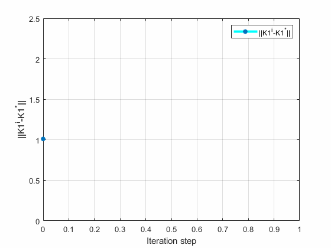
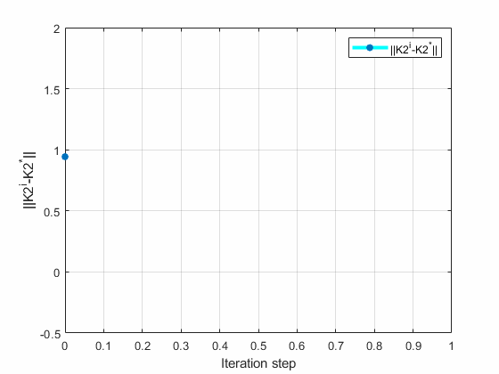

# [Matlab] Off-Policy Reinforcement Learning for Nonzero-Sum Game Discrete-time System

## Introduction
This is my simulation for the Algorithm described in **Data-Driven Nonzero-Sum Game for Discrete-Time Systems Using Off-Policy Reinforcement Learning** [paper](https://ieeexplore.ieee.org/document/8933509).

## Experiments:
I used a different original control matrix than the article. 
```math
K_1^0 =    \begin{bmatrix}
 1 & 0 & 0
    \end{bmatrix}
;
K_2^0 =    \begin{bmatrix}
 1 & 0 & 0
    \end{bmatrix}

```

For the data collection phase, the probing noises are added to the behavior policy.

The corresponding feedback Nash equilibrium
```math
K_1^* =    \begin{bmatrix}
0.0086 & 0.0272 & -0.0667
    \end{bmatrix}
;
K_2^* =    \begin{bmatrix}
 -0.6444 & -0.8736 & 0.0005
    \end{bmatrix}

```

Using the OffPolicy algorithm, I found the following control matrices
```math
K_1^{\infty} =    \begin{bmatrix}
0.0086 & 0.0272 & -0.0667
    \end{bmatrix}
;
K_2^{\infty} =    \begin{bmatrix}
 -0.6444 & -0.8736 & 0.0005
    \end{bmatrix}

```

## Results
| Convergence of the optimal control matrix (Off-Policy)        |
| ------------- |
|       | 

| Convergence of the optimal control matrix (Off-Policy)       |
| ------------- |
|       | 


## How to use my code

With my code, you can:

* **Off-Policy Algorithm** by running `OffPolicyRLforNZSG.m`
* **Off-Policy Algorithm Result Animation** by running `Animation.m`

## Docker
I will provide DockerFile soon.

## Requirements

* **Matlab**
